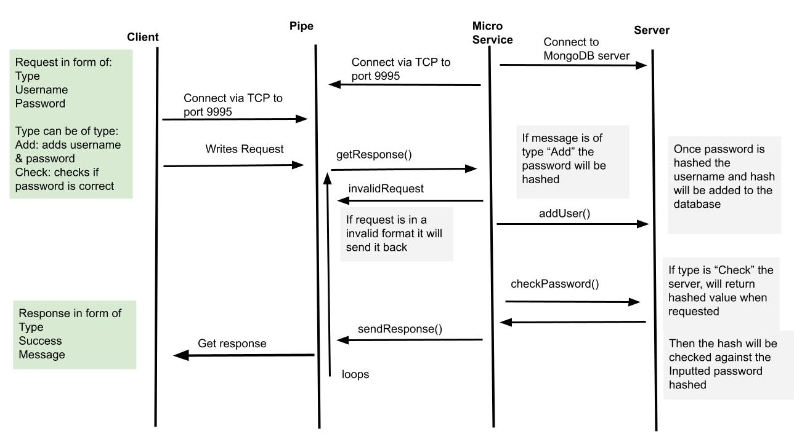

# Password-Authentication-MicroService
A user authentication, service. Allows, users to add user name and passwords. Then, can check if the username and password is correct.
Setup for a mongoDB database and uses Argon2ID for hashing password.

**Setup**
1. Install ZMQ with "pip install zmq" in the terminal
2. Install Argon with "pip install argon2-cffi" in the terminal
3. Install MongoDB with: "python -m pip install pymongo" and "python -m pip install pymongo[srv]" in the terminal
4. Create a mongoDB account and cluster at https://www.mongodb.com/
5. When it give you the connection string, set the URI variable in authentication to it.
6. If using VScode installing the mongoDB extension is recommended


**Requesting Data**
1. Connect to port 9995 via zmq
2. Send the data in the form of:
    Input type
    Username
    Password

Each value will be seperated by a new line.
Input types available are:
    Add - will add the username and password as a hash to the database
    Check - will check if password matches the one inputted

**Example Request**
```python
import zmq

#connects to socket
PORT_NUM = 9995
context = zmq.Context()
socket = context.socket(zmq.REQ)
socket.connect("tcp://localhost:" + str(PORT_NUM))

inputType = "Add
username = "Jon"
password = "Secure123"

messageSent = inputType + "\n" + username + "\n" + password
socket.send_string(messageSent)
```

**Receiving Data**
1. Data can be recieved by using the message = socket.recv() command in python after being sent
2. The format of recieving will be:
    Output Type
    Success
    Message

Output type - can be:
    Add - add the username and password as a hash to the database
    Check - check if password matches the one inputted
    Error - inputs inputted wrong for example, a invalid type or formatted wrong
Success - whether the request was a success or not, will be a 
    1 for Success 
    0 for Fail
Message - output message can provide more context for a error for example:
    "Invalid password"
    "Username and Password added"

Each output will be seperated by a new line

**Example Response**
```python
response = socket.recv()
response = response.decode()
responseSep = response.split("\n")

outputType = responseSep[0]
result = responseSep[1]
responseMessage = responseSep[2]

print("\nResponse:")
print(outputType)
print(result)
print(responseMessage)
```


